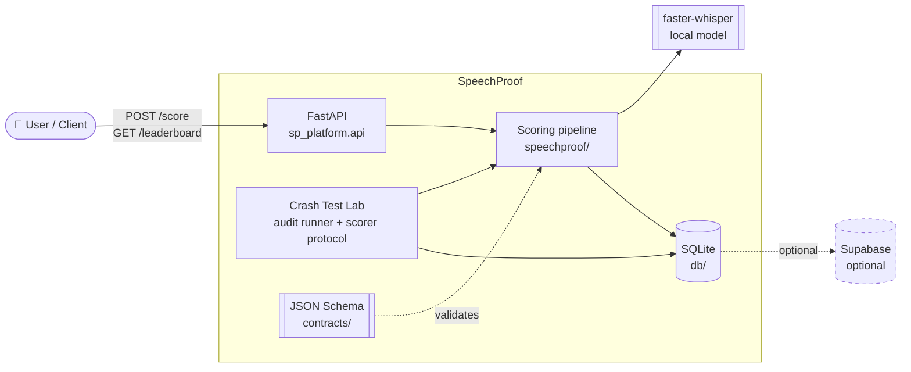
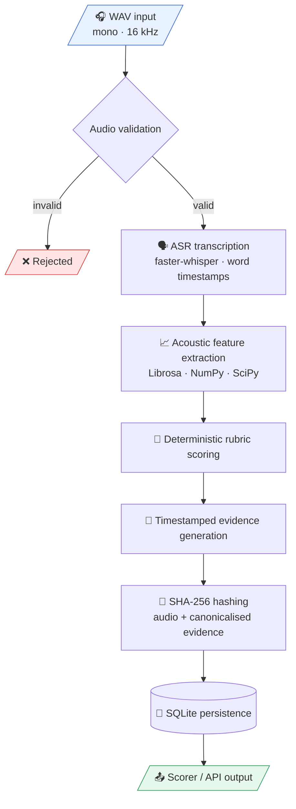
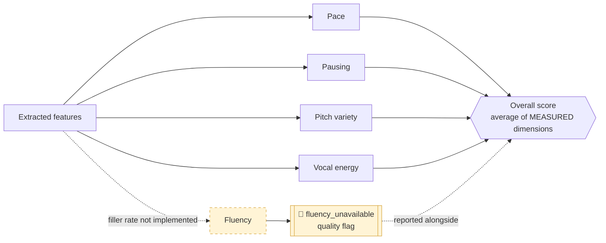
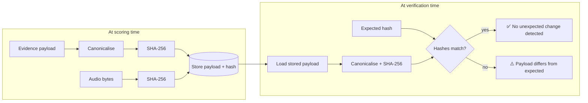
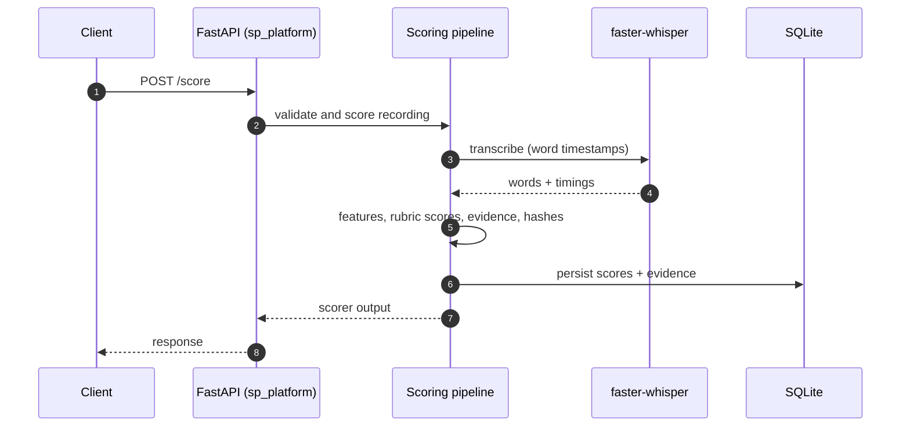
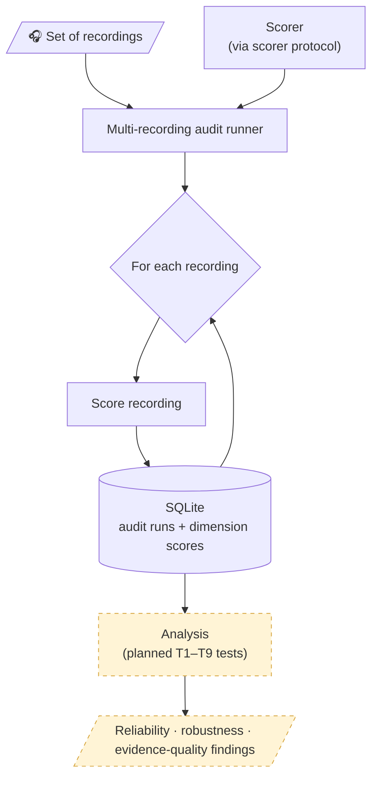
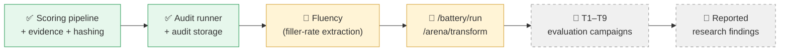

<div align="center">

# 🎙️ SpeechProof

### Evidence-backed speech scoring, plus a Crash Test Lab that asks whether the scorer deserves trust.

[](https://www.python.org/)
[](https://fastapi.tiangolo.com/)
[](https://github.com/SYSTRAN/faster-whisper)
[](https://github.com/OpenNMT/CTranslate2)
[](https://www.sqlite.org/)
[](https://docs.pytest.org/)
[](LICENSE)


**[Overview](#-overview) · [Architecture](#-architecture) · [Quick start](#-quick-start) · [API](#-api-reference) · [Crash Test Lab](#-crash-test-lab) · [Limitations](#-current-limitations)**

</div>

---

> ⚠️ **Honest status:** The scoring pipeline and its software-correctness tests are implemented. The planned **T1–T9 empirical evaluation campaigns have NOT been completed**. This repository reports **no benchmark results** and makes **no claim of scientific validity**.

---

## 📌 Overview

SpeechProof is a speech-scoring research prototype paired with a **Crash Test Lab**.

- The **scorer** analyses a WAV recording and produces rubric-based scores for pace, pausing, pitch variety, and vocal energy, each with timestamped evidence.
- The **Crash Test Lab** is the research half. It is designed to check whether speech scorers respond correctly to controlled changes and whether the evidence they produce can be independently examined.

The goal is not just to give someone a speaking score. It is to measure whether the scorer itself is reliable, robust, and honest about what it did and did not measure.

---

## ✨ Features

| | Feature | Detail |
|---|---|---|
| ✅ | **Audio validation** | WAV, mono, 16 kHz input is checked before scoring |
| 🗣️ | **Local ASR with word timestamps** | `faster-whisper` on CTranslate2, using a locally available model |
| 📈 | **Acoustic features** | Librosa, NumPy, SciPy |
| 📐 | **Deterministic rubric scoring** | Fixed rules, no randomness in the scoring step |
| 🔎 | **Timestamped evidence** | Long pauses reported with timestamps, measurements, thresholds, and nearby recognised words where available |
| 🔐 | **SHA-256 hashing** | Audio and canonicalised evidence payloads are hashed |
| 💾 | **Local persistence** | SQLite by default, optional Supabase |
| 🚩 | **No invented scores** | Unmeasured dimensions are flagged (`fluency_unavailable`), never guessed |
| 🧪 | **Crash Test Lab foundations** | Scorer protocol, multi-recording audit runner, SQLite audit storage |
| 🌐 | **FastAPI service** | `POST /score` and `GET /leaderboard` |

---

## 🧭 Why SpeechProof is different

| Typical scorer | SpeechProof |
|---|---|
| Returns a number | Returns a score **and** timestamped evidence behind it |
| Opaque logic | Deterministic, inspectable rubric |
| Silently fills in missing measurements | Flags missing dimensions and does not invent values |
| Evidence is hard to recheck | Payloads are SHA-256 hashed so unexpected changes can be detected against an expected hash |
| Scorer is trusted by default | Scorer is meant to be **tested**, via the Crash Test Lab |

> **About hashing:** hash verification can detect unexpected payload changes when compared with an expected hash. It does **not** make the system tamper-proof, and hashing alone does not prove authenticity.

---

## 🏗️ Architecture

### System context



### Scoring pipeline



### Scoring dimensions and the fluency gap



### Evidence integrity flow



> A match means the payload equals what the expected hash describes. It is not proof of who made the recording or that it is genuine.

### `POST /score` interaction (conceptual)



> This diagram is conceptual. Exact request and response fields are defined by the FastAPI source in [`sp_platform/`](sp_platform); see `/docs` when the server is running.

---

## 🧰 Technology stack

| Layer | Technology |
|---|---|
| Language | Python 3.11 |
| Speech recognition | faster-whisper, CTranslate2 |
| Audio / signal processing | Librosa, NumPy, SciPy |
| API | FastAPI (served with Uvicorn) |
| Storage | SQLite (default), optional Supabase |
| Contracts | JSON Schema |
| Testing | Pytest |
| Environment | Conda (`environment.yml`) |

---

## 📊 Current scoring dimensions

| # | Dimension | Status |
|---|---|---|
| 1 | Pace | ✅ Measured |
| 2 | Pausing | ✅ Measured |
| 3 | Pitch variety | ✅ Measured |
| 4 | Vocal energy | ✅ Measured |
| 5 | Fluency | 🚫 **Not measured** (filler-rate extraction not implemented) |

The overall score averages **only the dimensions actually measured**. When fluency is missing, the scorer exposes the `fluency_unavailable` quality flag instead of inventing a value.

> Scores are prototype feedback signals, **not** validated universal measures of speaking ability.

---

## 🚀 Quick start

**Prerequisites:** [Conda](https://docs.conda.io/) and Git.

```bash
git clone https://github.com/aryankalpeshchavan-glitch/SpeechProof.git
cd SpeechProof

conda env create -f environment.yml
conda activate speechproof
```

Sanity checks:

```bash
python -m compileall speechproof sp_platform db contracts tests
pytest -q
```

---

## ⚙️ Model preparation and GPU configuration

SpeechProof uses a **local** `faster-whisper` model so transcription can run offline once the model is available.

```bash
python -m speechproof.asr --prepare-model
```

**GPU notes**

- The development smoke test has used `large-v3` with **CUDA** and `float16` in the developer's environment.
- That is one tested configuration, **not a guarantee for every machine**.
- Offline GPU execution needs compatible NVIDIA drivers, matching CUDA runtime libraries for CTranslate2, and a locally available model.
- Without such a setup, adjust the ASR configuration for your hardware.

---

## 🧪 Running tests

```bash
pytest -q                                                       # test suite
python -m compileall speechproof sp_platform db contracts tests # compile check
git diff --check                                                # whitespace / diff hygiene
```

The suite covers software correctness: audio validation, evidence integrity, duration propagation, and separate recording/run associations in audit storage.

> These tests show the **code behaves as designed**. They are **not** empirical validation of the scoring method.

---

## 🔥 Running the real smoke test

```bash
python smoke_test_runner.py
```

Requirements:

- An **authorised**, locally available **16 kHz mono WAV** at the configured input path
- A locally available ASR model (see [Model preparation](#️-model-preparation-and-gpu-configuration))
- A compatible model/runtime configuration (for example, working CUDA libraries if GPU is configured)

The command will not work without its audio, model, and environment dependencies.

---

## 🌐 Starting the API

```bash
python -m uvicorn sp_platform.api:app --reload
```

FastAPI normally serves interactive OpenAPI docs at `/docs` unless disabled. Use them to inspect exact request and response schemas for your checkout.

---

## 📡 API reference

| Method | Path | Status | Description |
|---|---|---|---|
| `POST` | `/score` | ✅ Implemented | Scores a recording |
| `GET` | `/leaderboard` | ✅ Implemented | Returns leaderboard data |
| `POST` | `/battery/run` | 🚧 Placeholder, returns **HTTP 501** | Planned test-battery execution |
| `POST` | `/arena/transform` | 🚧 Placeholder, returns **HTTP 501** | Planned controlled audio transformations |

A concrete request example is intentionally omitted: parameters and response fields are defined in [`sp_platform/`](sp_platform), and documenting them without verification risks drifting from the real interface. Start the server and open `/docs`.

---

## 🗂️ Project structure

```text
SpeechProof/
├── speechproof/          # Core pipeline: ASR, features, scoring, evidence
├── sp_platform/          # FastAPI application (sp_platform.api:app)
├── db/                   # SQLite persistence: scores, evidence, audit runs
├── contracts/            # JSON Schema contracts
├── tests/                # Pytest suite
├── smoke_test_runner.py  # Real-audio smoke test entry point
├── environment.yml       # Conda env "speechproof" (Python 3.11)
└── LICENSE               # MIT
```

| Path | Purpose |
|---|---|
| [`speechproof/`](speechproof) | Scoring pipeline, including `speechproof.asr` for model preparation |
| [`sp_platform/`](sp_platform) | FastAPI app |
| [`db/`](db) | Storage for scoring records, evidence, audit runs |
| [`contracts/`](contracts) | JSON Schema definitions |
| [`tests/`](tests) | Software-correctness and regression tests |

The repository may contain additional directories not listed here. There is currently **no frontend**.

---

## 🧨 Crash Test Lab

The Crash Test Lab is the research layer. Instead of trusting a scorer, it audits one.

### Audit flow



Solid boxes are implemented foundations. Dashed boxes are **planned** and not yet complete.

### Implemented foundations

- Scorer protocol
- Multi-recording audit runner
- SQLite storage for audit runs and dimension scores
- Regression tests for separate recording/run associations
- Evidence integrity tests
- Duration propagation tests
- Audio validation tests

### Planned evaluations (not yet completed)

| Property | Question it asks |
|---|---|
| Reproducibility | Does the same input give the same output across runs? |
| Dose-response sensitivity | Does the score move in proportion to a controlled change in the audio? |
| Dimension cross-talk | Does changing one quality unintentionally move other dimensions? |
| Temporal localisation | Does the evidence point to the right moment in the recording? |
| Nuisance invariance | Is the score stable under changes that should not matter? |
| Agreement with human raters | How closely do scores track human judgements? |
| Variance analysis | How much of the score variation is noise? |
| Minimum detectable change | What is the smallest real change the scorer can reliably detect? |
| Resistance to gaming | Can the score be inflated without genuinely improving the speech? |

### Roadmap



The ordering above is an illustrative sketch, not a committed schedule.

---

## 🚧 Current limitations

- **No completed research evaluation.** T1–T9 are pending, so SpeechProof is not shown to be a valid or reliable measure of speaking ability.
- **Software tests are not research validation.**
- **Fluency is not measured.** Filler-rate extraction is not implemented.
- **Limited evidence types.** Evidence is currently generated for detected long pauses.
- **Restricted input.** Only 16 kHz mono WAV is supported.
- **Placeholder endpoints.** `/battery/run` and `/arena/transform` return HTTP 501.
- **Hardware-dependent ASR.** GPU execution requires compatible drivers, runtime libraries, and a local model; CUDA is not assumed.
- **Hashing is not proof of authenticity.**
- **No frontend** and no verified deployment configuration.
- **Scores are prototype feedback signals**, not validated universal measures.

---

## 🔒 Privacy, consent, and responsible use

Speech recordings are personal data and can identify individuals.

- **Get consent.** Only process recordings you are authorised to use, and tell speakers how their audio and derived data are stored.
- **Keep audio out of Git.** Do not commit private recordings, transcripts, databases, or model caches.
- **Local by default.** ASR runs locally and records go to a local SQLite database. If you enable the optional Supabase integration, data leaves your machine, so review that setup first.
- **Protect credentials.** Keep keys in environment variables or an untracked file, never in the repository.
- **No high-stakes use.** SpeechProof is not validated for hiring, admissions, assessment, or other consequential decisions about people.
- **Interpret carefully.** Speech varies with accent, language background, speech or hearing differences, and recording conditions. The scoring has not been evaluated for fairness across such groups.

---

## 🤝 Contributing

1. Fork the repository and create a feature branch.
2. Set up the environment as described in [Quick start](#-quick-start).
3. Make your change and add or update tests.
4. Run the checks:

   ```bash
   pytest -q
   python -m compileall speechproof sp_platform db contracts tests
   git diff --check
   ```

5. Open a pull request describing what changed and why.

Please keep documentation aligned with what is actually implemented and measured. Never include private recordings or credentials in issues or pull requests.

---

## 📄 License

Released under the [MIT License](LICENSE). Copyright (c) 2026 Aryan Chavan.
